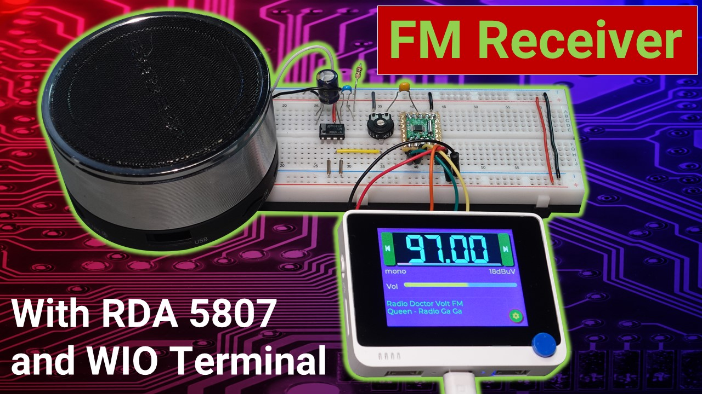

# FM radio receiver with RDA5807 and Seeed WIO-Terminal

It's so easy to build a radio these days. You don't need to to solder complicated circuits, wind coils and do complicated adjustments that require expensive measuring equipment. Modern integrated circuits like the single chip FM receiver RDA 5807 already contain complete stereo and RDS capable FM receivers! They are conveniently controlled via the I2C interface, which allows them to be connected to any microcontroller or single board computer with just a few wires. Here I have created a graphical user interface for the WIO terminal with the help of the LVGL library. The circuit can be built with a few components on a breadboard.

Watch the video for more details.

